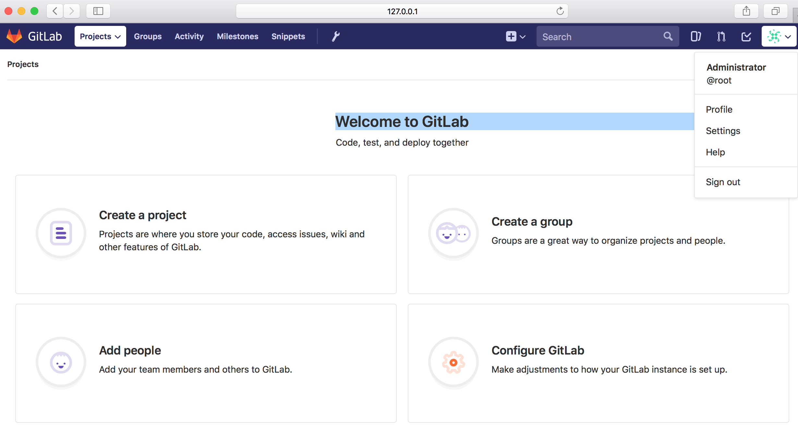

# Authenticating Gitlab CE users with Red Hat SSO 

Gitlab CE refers to the community edition of the popular source code management tool Gitlab.
On the devops journey, Clouds platforms like Openshift  enable developpers to create a custom Application Image from source code throughthe Source to image process: S2I.
Most often the source code is hosted in an external Git repository but more and more users are considering Gitlab hosting on Openshift platform.
Here come the security dilema with all it pitfalls: authorisations, authentification, etc..
In the following blog post series we will see how to secure a Gitlab containerired instance using Red Hat SSO.
Red hat SSO support both SAML and OpenID Connect protocol, in the first part of this blog post serie, we will 
Handle SAML interconnection; OpenID Connect will be handled in a second blog post.


## Setup Gitlab CE

You can start a custom CE gitlab instance by running the following docker command 

```
$ docker run -d  -p 7080:80  gitlab/gitlab-ce 

```
This  command pull the image gitlab/gitlab-ce: latest from docker hub and start a new dockerized  gitlab instance.

Fill the screen 
Create a local admin acccount with the following credentials for example
```
New Password: P@ssw0rd
confirm New  Password P@ssw0rd
```
login with root/P@ssw0rd


you are now connected to the admin panel.
here we used a local account to logon, in the follwing section we will see how to enable SAML authentification through RHSSO


## Installing Red Hat SSO


## SAML 
### Create a gitlab-ce-saml client
### Adding RHSSO as SAML Provider in Gitlab.


## OpenID Connect
